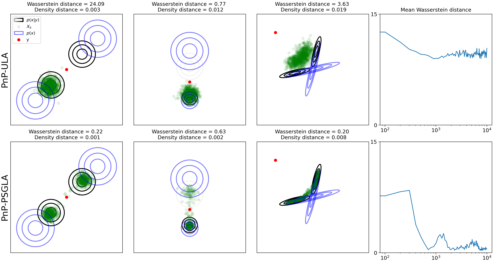
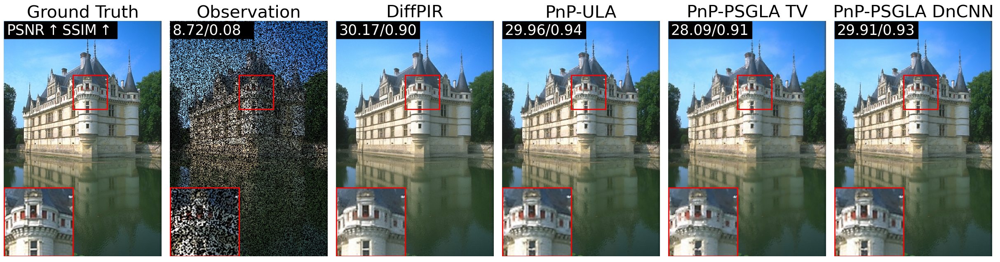

# Posterior Sampling using Proximal Stochastic Gradient Langevin Algorithm (PSGLA)

This repository contains associated with the paper [From stability of Langevin diffusion to convergence of proximal MCMC for non-log-concave sampling](https://arxiv.org/abs/2505.14177).

The goal is to sample posterior distribution for inverse problem in two context :
- Gaussian Mixture Model in 2D
- Inverse problem in imaging (includind inpainting and deblurring)

To do so, we implemented various methods including PnP ULA and PnP PSGLA.


*Figure 1 – Posterior Sampling with PnP-ULA (top row) and PSGLA (bottow row) with three different Gaussian Mixture prior distributions (in blue) and three observations (in red) leading to three posterior distributions (in black, mode probabilities are represented by transparency). The Wasserstein distance during the iterations (right column) is averaged between the three experiments. Note that PnP-PSGLA succeeds to sample the posterior distribution even if there are various modes and the convergence is faster than PnP-ULA.*


*Figure 2 – Qualitative result for image inpainting with 50\% masked pixels and a noise level of $\sigma = 1 / 255$ and various restoration methods implemented in this repository. PnP-ULA is run with 1,000,000 iterations and PSGLA with 10,000 iterations.*


## Environment definition

Our code that is based on Pytorch and DeepInv libraries, you need to create a conda environment with our libraries version

```
conda env create -f environment.yml
```

## Deep Neural Networks Weights 

To run the code, you need to create a folder named "Pretrained_models" and download to follow open source weights and put them in the folder "Pretrained_models" :
- For DnCNN with control Lipschitz constant proposed by [Learning Maximum Monotone](https://github.com/matthieutrs/LMMO_lightning) follow this [link](https://huggingface.co/deepinv/dncnn/resolve/main/dncnn_sigma2_color.pth?download=true)
- For the original DRUNet proposed by [DPIR](https://github.com/cszn/DPIR) follow this [link](https://huggingface.co/deepinv/drunet/resolve/main/drunet_deepinv_color.pth?download=true)
- For the Gradient-Step DRUNet proposed by [GSDRUNet](https://github.com/samuro95/GSPnP) follow this [link](https://huggingface.co/deepinv/gradientstep/resolve/main/GSDRUNet.ckpt)
- For the Prox-DRUNet proposed by [Prox-DRUNet](https://github.com/samuro95/Prox-PnP) follow this [link](https://plmbox.math.cnrs.fr/f/faf7d62213e449fa9c8a/?dl=1)

## Run experiments in 2D

To run the PnP-PSGLA and PnP-ULA on Gaussian Mixture in 2D use the following command

```
python sampling_2D.py 
```
It will run algorithms with various number of iterations (100, 1000 and 10000) with 3 differents GMM priors and 3 differents observations

Use the option --N to fix the number of iteration and --name with the option in['symetric_gaussians', 'disymmetric_gaussians', 'cross'] for a specific GMM prior. For example you can run
```
python sampling_2D.py --N 1000 --name 'symetric_gaussians'
```
to run PnP-ULA and PnP-PSGLA on three observations with the 'symetric_gaussians' prior and 1000 iterations. You can also use the option '--metric_each_step True' to compute the Wasserstein distance between the sampling law and the true posterior at each iterations.

## Run experiments for images

To run the PnP-PSGLA on to sample image posterior distribution use the following command (by default, it is random inpainting with 50% missing pixels)

```
python sampling_images.py --dataset_name "set1c" --alg "psgla"
```
**WARNING**: You need to upload the 'DnCNN' denoiser weights in the folder "Pretrained_models" to run the line.

The output must be :
"""
The output PSNR : 29.91 dB / output SSIM : 0.93
"""

### Different option for sampling_images.py
We describe here all the option that can be use with sampling_images.py file. First let's give three examples of code to run PnP, DiffPIR and PnP-ULA
```
python sampling_images.py --dataset_name "set3c" --alg "pnp" --den "GSDRUNet" --s 5.0 --lambd 0.5
```
```
python sampling_images.py --dataset_name "CBSD68" --alg "diffpir" --den "GSDRUNet"
```
```
python sampling_images.py --dataset_name "set1c" --alg "pnp_ula" --N 100000 --Pb 'deblurring'
```
- alg : Choice of the restoration algorithm (type=str, default = 'psgla', choice =['psgla', 'pnp_ula', 'pnp', 'red', 'diffpir', 'baseline'])
- den : Choice of denoiser with pretrained weights on color natural images (type=str, default = 'DnCNN', choice=['Prox_DRUNet', 'DnCNN', 'DRUNet', 'GSDRUNet', 'Prox_DRUNet', 'TV'])
- dataset_name : Name of dataset of images to reconstruct (type = str, default = 'set1c', choice = ['set1c', 'set3c', 'CBSD10', 'CBSD68'])
- N : Number of iteration of the algorithm (type=int, default=10000)
- Pb : Type of inverse problem to tackle (type=str, default = 'inpainting', choice=['deblurring', 'inpainting'])
- alpha : Relaxation parameter of the denoiser (type=float, default=1.)
- s : Noise level of the denoiser (type=float, default=5.). The denoiser is then apply with the noise parameter s/255.
- delta : Step-size of the algorithm (type=float, default = 3e-5)
- lambd : Regularization parameter (type=float, default = 1.)
- path_result : Path to save the results. By defaults, it will be save in results/path_result (type=str, default='images')
- gpu_number : Number of the GPU to run algorithm (type=int, default = 0)
- blur_type : Type of blur to apply (type=str, default = 'uniform', choice=['uniform', 'gaussian'])
- sigma : Noise level of the observation (type=float, default = 1.)
- l : Size of the blur kernel (2*l+1)*(2*l+1) for deblurring (type=int, default = 4)
- si : Variance of the blur kernel in case of gaussian blur  (type=float, default = 1.)
- prop : Proportion of masked pixels in random inpainting (type=float, default = 0.5)
- zeta : Regularization weights for DiffPIR between 0 and 1. (type=float, default = 0.8)
- t_start : Time of start for DiffPIR (type=int, default = 200)
- seed_ip : Seed for the observation randomness (type=int, default = 0)
- seed_alg : Seed for the algorithm running (type=int, default = 0)
- save_images_online : With the command --save_images_online it save images online.
- den_TV_it : Number of iteration to estimate the Prox TV at each iteration of the algorithm (type=int, default = 10)
- indx_start : Indice of image to start to restore inside the dataset. Helpful to separate the computation to restore a large dataset. (type = int, default = 0)

## Acknowledgments 

This repository contains part of code from :
- [PnP ULA posterior law sensitivity](https://github.com/Marien-RENAUD/PnP_ULA_posterior_law_sensivity)

And use tools for the library :
- [DeepInv](https://deepinv.github.io/deepinv/)

## Citation
If you use this code, consider cite
```
@misc{renaud2025stabilitylangevindiffusionconvergence,
      title={From stability of Langevin diffusion to convergence of proximal MCMC for non-log-concave sampling}, 
      author={Marien Renaud and Valentin De Bortoli and Arthur Leclaire and Nicolas Papadakis},
      year={2025},
      eprint={2505.14177},
      archivePrefix={arXiv},
      primaryClass={stat.ML},
      url={https://arxiv.org/abs/2505.14177}, 
}
```